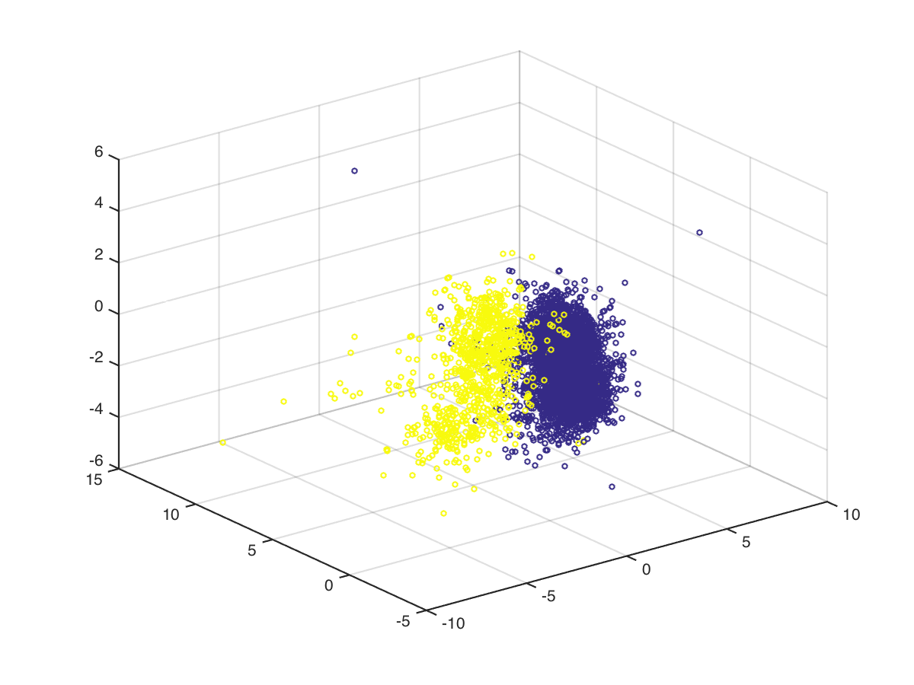
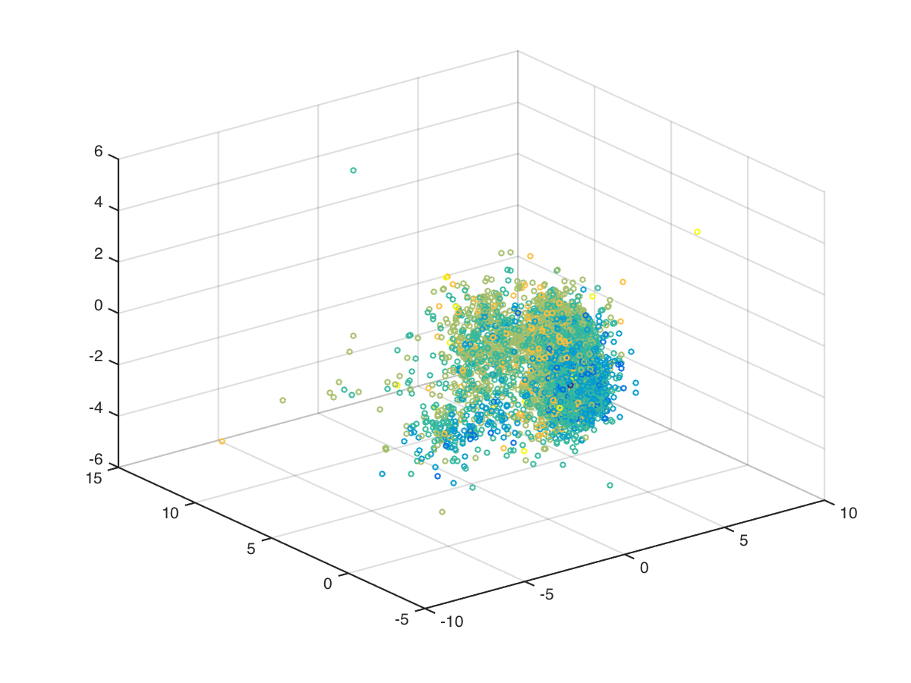
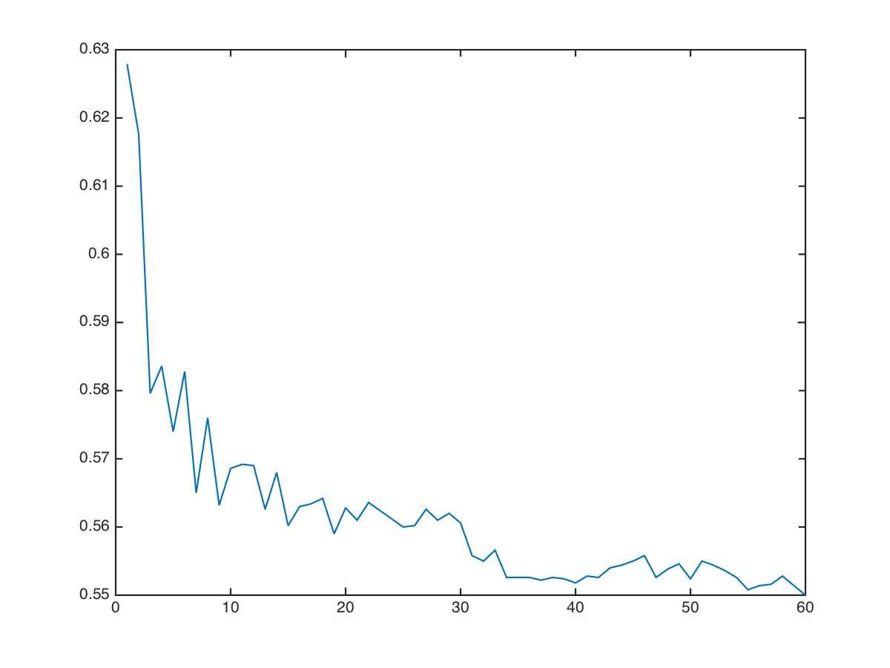

# Machine Learning Challenge 2014 (Aalto University)

## Predict the type of the wine

The task is about predicting the type of the wine given some chemical characteristics. The labels are: white (labeled as 0) and red (labeled as 1). Visualizing the data using dimensionality reduction leads to the following result:

</img>

As it shows by the figure the two classes are easily separable. In order to predict the type of the wines using logistic regression use the following command:

	cd src/logistic-regression
    octave main_type.m

In this case the accuracy is pretty high (99.1% with cross validation). The approach is to run a cross validation with different values for lambda (the regularization term) and pick the best model. See the code for the details.

## Predict they quality

This task is about predicting the quality of wine using a scale between 1 and 7. Visualizing the data in 3d shows how much more complex this task is:

</img>

### Logistic regression

Using logistic regression does not lead to good results. In order to run the logistic regression with a one-vs-all classifier it is necessary to use the following commands:

	cd src/logistic-regression
	octave main_quality.m

It is also possible to do an exhaustive feature selection. It takes a lot of time and it doesn't lead to significant improvements. In order to use it run:

	cd src/logistic-regression
	octave main_quality_fs.m

### Matlab K-NN

It's possibile find the a matlab program that classifies the quality of wines in the "matlab" folder. The used algorithm is K-NN, the program uses a manual (i.e. not the one from matlab) cross validation; the crucial line is:

	model = fitcknn(X, y,
	               'NumNeighbors', k,
	               'NSMethod','kdtree',
	               'Distance','minkowski',
	               'BreakTies', 'nearest',
	               'Standardize', true);

You can find more information about this model here:

[http://www.mathworks.se/help/stats/fitcknn.html](http://www.mathworks.se/help/stats/fitcknn.html)

In order to run the code you have to execute with matlab:

	matlabknn.m

The program tries a lot of values of "k" and outputs the chart of the accuracies, which should be something like this:

</img>

### K-NN

This is my version of the K-NN classifier in octave, it utilizes a nice vectorization strategy to compute the euclidean distance between points.

The tie-breaking is done either random or using the smallest value. See comments in the code.

In order to run it, it necessary to use the following commands:

	cd src/k-nn
	octave k-nn.m

### PCA

In the matlab folder it is possible to find the my implementation of PCA, the following snippet of code shows how to use it:

	% Normalize the training set
	[X_norm, mu, sigma] = featureNormalize(data_t);

	[U, S, V] = computePCA(X_norm);

	dimensions = 3;
	Z     = projectData(X_norm, U, dimensions);
	X_rec = recoverData(Z, U, dimensions);

### More info

For more information, check:

* [Final Report](./paper/final_report.pdf)
* [Summary](./presentation/summary.pdf)
* [Presentation](./presentation/presentation.pdf)
